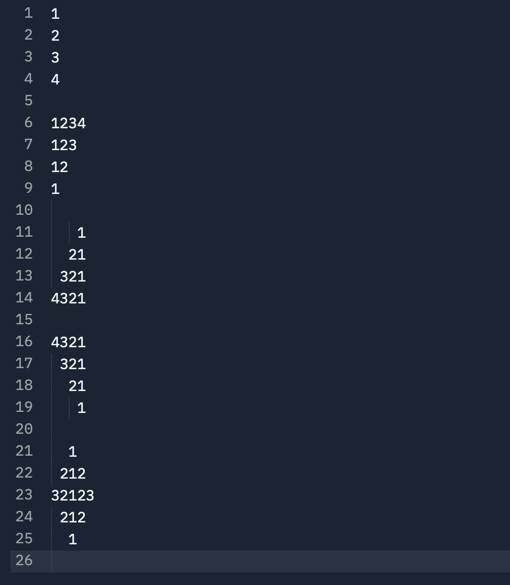
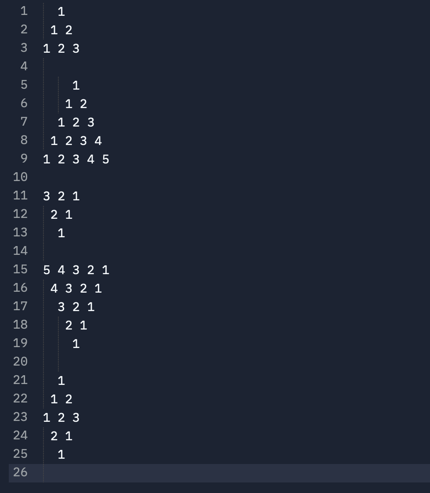
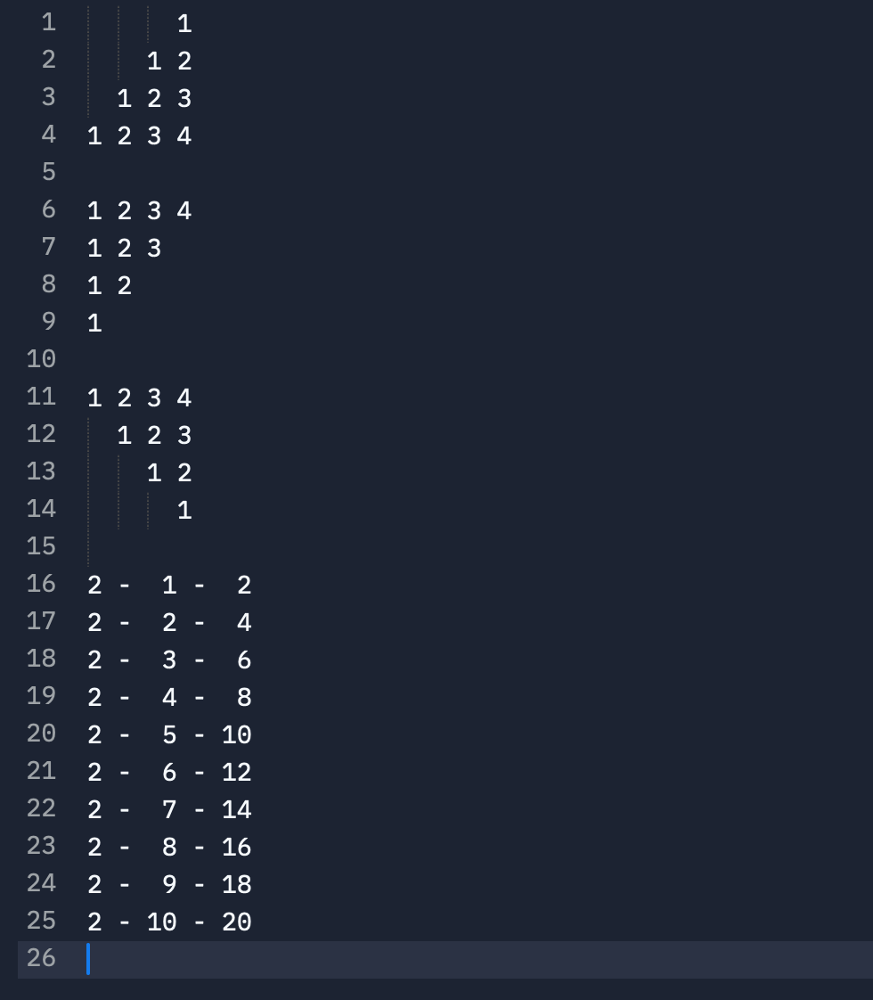

# Instructions

## Task: Type patterns of numbers
Type the patterns of numbers as shown bellow in 3 files `pattern-01.txt`, `pattern-02.txt` and `pattern-01.txt`. 

### Pattern-01

In file `pattern-01.txt` type

### Pattern-02

In file `pattern-02.txt` type

### Pattern-03

In file `pattern-03.txt` type  

## Submit your work

Once done typing the patterns in all 3 files.  
`Verify` what you typed in the 3 files with `any person` sitting beside you.  

And then click the `Submit` button on the top-right corner.
